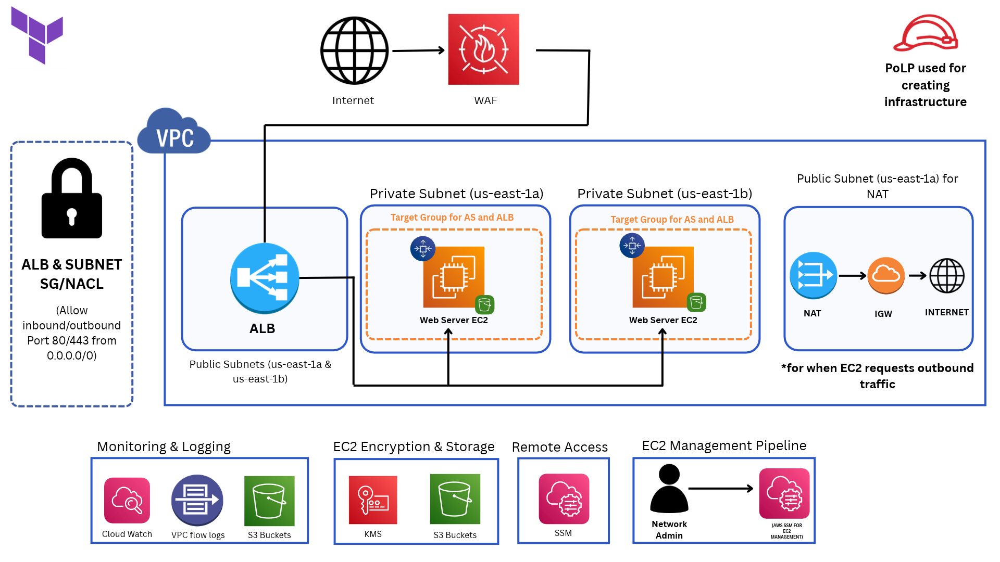

# ☁️ Secure AWS Web Infrastructure — Terraform, WAF & DevSecOps

> **A production-style AWS web server environment built from scratch with Terraform, designed around private networking, least privilege, redundancy, monitoring, encryption, and automated deployment.**



I designed and deployed a **secure, highly available web application environment on AWS** using **Terraform** rather than manually building the infrastructure in the AWS Console.

The key idea is simple:

**Internet → AWS WAF → ALB → Private EC2 Web Servers**

Behind that flow, the environment adds:

- **Multi-AZ deployment** for redundancy
- **Auto Scaling** for changing workloads
- **NAT Gateway** for controlled outbound internet access from private EC2 instances
- **SSM Session Manager** instead of exposing SSH
- **IAM least privilege** for access control
- **KMS encryption** for data at rest
- **Private S3 buckets with Block Public Access**
- **VPC Flow Logs + CloudWatch** for visibility and monitoring
- **Docker** for application packaging
- **CI/CD** for repeatable infrastructure workflows
- A planned **WAF security-testing phase** using controlled web attack simulations

This project combines **cloud engineering + cloud security + Infrastructure-as-Code + DevSecOps** in one environment.

---

# 🏗️ What I Built

| Component | What it does | Why it matters |
|---|---|---|
| **Amazon VPC** | Isolates the environment | Network segmentation |
| **Public Subnets** | Host internet-facing infrastructure | Controlled public entry |
| **Private Subnets** | Host EC2 web servers | Prevents direct internet exposure |
| **AWS WAF** | Filters malicious web requests | Application-layer protection |
| **Application Load Balancer** | Receives web traffic and distributes it | Availability + controlled access |
| **EC2 + Auto Scaling** | Runs the web application and scales capacity | Resilience + elasticity |
| **NAT Gateway** | Gives private EC2 outbound internet access | Internet access without public exposure |
| **SSM Session Manager** | Provides administrative access to EC2 | No SSH exposure |
| **IAM** | Controls permissions | Least privilege |
| **KMS** | Encrypts data at rest | Data protection |
| **S3** | Stores logs/data | Durable storage |
| **CloudWatch** | Monitors resources and metrics | Visibility + operations |
| **VPC Flow Logs** | Records network flow information | Network investigation |
| **Docker** | Packages the application | Consistent deployment |
| **CI/CD** | Automates infrastructure workflow | Repeatability + DevOps |

---

# 🧠 Architecture at a Glance

```text
INTERNET
   │
   ▼
AWS WAF (auto-protect)
   │
   ▼
ALB (Application Load Balancer)
   │
   ├──────────────┐
   ▼              ▼
EC2 (AZ 1)     EC2 (AZ 2)
   │              │
   └──────┬───────┘
          ▼
      NAT Gateway
          │
          ▼
      INTERNET
```

```text
Monitoring / Logging
  EC2/VPC → VPC Flow Logs → S3
  EC2/AWS → CloudWatch → Monitoring

Administration
  Admin → SSM Session Manager → Private EC2

Encryption
  S3 / stored data → AWS KMS
```

### Security boundary

The important design decision is that **the web servers are private**.

Users do not connect directly to EC2.

```text
❌ Internet → EC2

✅ Internet → WAF → ALB → Private EC2
```

The ALB is the controlled public entry point, while the EC2 layer stays inside private subnets.

---

# 🔐 Security Design

This project was intentionally designed around **defense in depth** rather than relying on one security control.

### 1. Web Application Protection

**AWS WAF** is placed in front of the ALB and uses automatic protection to inspect incoming web traffic.

Future testing will validate the WAF using controlled requests such as:

- Directory traversal
- Injection-style requests
- Suspicious URL/request patterns
- Other common web attack simulations
- Controlled high-volume request testing

> **Attack simulations are a future validation phase and are not being presented as completed yet.**

### 2. Network Segmentation

EC2 web servers live in **private subnets** across multiple Availability Zones.

This limits their exposure and gives the environment redundancy.

### 3. No SSH Exposure

Instead of opening port 22 for administration, the project uses **AWS Systems Manager Session Manager**.

```text
Administrator
      │
      ▼
SSM Session Manager
      │
      ▼
Private EC2
```

### 4. Least Privilege IAM

IAM roles and policies are used to give users and AWS services only the permissions required for their job.

This applies the **Principle of Least Privilege (PoLP)** throughout the environment.

### 5. Storage Protection

S3 is configured as **private storage** with **Block Public Access** enabled.

Data at rest is protected using **AWS KMS**.

### 6. Network Visibility

**VPC Flow Logs** provide visibility into network communication and create a useful source of evidence for troubleshooting and security investigation.

---

# 🌐 How Traffic Works

### Inbound traffic

```text
Internet
   │
   ▼
 WAF
   │
   ▼
 ALB
   │
   ▼
Private EC2
```

Only the required web traffic is exposed to the application path.

### Outbound traffic from EC2

```text
Private EC2
    │
    ▼
NAT Gateway
    │
    ▼
Internet Gateway
    │
    ▼
Internet
```

This lets private instances reach external resources without turning them into public-facing servers.

---

# 📈 Availability & Scaling

The architecture uses **multiple Availability Zones** so the application is not dependent on a single EC2 instance, subnet, or AZ.

Auto Scaling is used to adjust EC2 capacity based on workload.

I also created **mock CPU usage testing** to demonstrate how increased resource utilization can be used to trigger scaling behavior.

```text
Normal workload
      │
      ▼
  EC2 ─── EC2

Higher workload
      │
      ▼
EC2 ─── EC2 ─── EC2 ─── EC2
```

This gave me hands-on experience with:

**Availability Zones → Redundancy → Load Balancing → Auto Scaling**

---

# 📊 Monitoring & Logging

The environment was designed so that security and operational events can be observed rather than simply creating infrastructure and hoping it works.

### VPC Flow Logs

Used for network visibility and traffic investigation.

### CloudWatch

Used for monitoring and metrics such as:

- EC2 CPU utilization
- Resource behavior
- Alarms
- Operational visibility

### S3

Used as a durable destination for stored logs/data.

The overall flow is:

```text
AWS Resources
     │
     ├── VPC Flow Logs
     │
     └── CloudWatch
             │
             ▼
            S3
```

---

# 🛠️ Infrastructure as Code

The entire environment is built with **Terraform**.

Instead of clicking through the AWS Console, infrastructure is described as code and can be recreated consistently.

Core workflow:

```bash
terraform init
terraform fmt
terraform validate
terraform plan
terraform apply
```

Cleanup:

```bash
terraform destroy
```

This project taught me how to think about cloud infrastructure as a **reproducible system** rather than a collection of manually configured resources.

---

# 🔄 CI/CD

The project also includes a **CI/CD pipeline** for automating infrastructure checks and deployment workflow.

Conceptually:

```text
GitHub
   │
   ▼
CI/CD
   │
   ├── Format / Validate
   ├── Terraform checks
   ├── Terraform Plan
   └── Deployment workflow
           │
           ▼
          AWS
```

This connects the infrastructure work to a real development workflow instead of treating Terraform as a one-time script.

---

# 🐳 Docker

The application is also packaged using **Docker**.

The purpose is to keep the application runtime consistent and make deployment easier to reproduce.

```text
Docker
   │
   ▼
Application
   │
   ▼
EC2
```

---

# 🧪 Security Validation — Planned

After the core infrastructure is complete, I will use controlled security testing to validate the WAF and monitoring pipeline.

Planned flow:

```text
Controlled Attack Request
          │
          ▼
         WAF
       ┌───┴───┐
       │       │
     Block   Allow
       │       │
       │       ▼
       │      ALB
       │       │
       │       ▼
       │   Private EC2
       │
       └──► Logs / Monitoring
```

The goal is to demonstrate the complete security lifecycle:

**Attack → Detection/Filtering → Logging → Investigation**

Evidence will include screenshots, logs, WAF results, and a video demonstration.

---

# 🎓 What I Learned

This project was not just about learning individual AWS services. It taught me how the services fit together to create an actual cloud environment.

## ☁️ AWS / Cloud Engineering

**Learned and applied:**

- VPC design
- Public vs private subnets
- Availability Zones
- Multi-AZ redundancy
- Internet Gateways
- NAT Gateways
- Application Load Balancers
- EC2
- Auto Scaling
- S3 storage
- SSM Session Manager

## 🔐 Cloud Security

**Learned and applied:**

- AWS WAF
- Security Groups
- Network ACLs
- IAM roles and policies
- Principle of Least Privilege
- Private networking
- Eliminating unnecessary SSH exposure
- KMS encryption
- S3 Block Public Access
- Security testing methodology

## 🏗️ Infrastructure as Code

**Learned and applied:**

- Terraform templating
- Variables
- Outputs
- Locals
- Resource relationships
- Infrastructure dependencies
- `terraform plan`
- `terraform apply`
- `terraform validate`
- `terraform fmt`
- Reproducible deployments

## 📊 Monitoring / Operations

**Learned and applied:**

- VPC Flow Logs
- CloudWatch
- Log collection
- Metrics
- CPU monitoring
- Auto Scaling behavior
- Mock workload generation
- Investigating infrastructure behavior

## 🐧 Linux

**Learned and applied:**

- Linux server administration
- Networking
- Services
- Permissions
- Application deployment
- Troubleshooting
- Remote management through SSM

## 🚀 DevOps / Engineering

**Learned and applied:**

- Docker
- CI/CD
- GitHub workflows
- Documentation
- Architecture diagrams
- Reading AWS/Terraform documentation
- Designing infrastructure before deployment

---

# 💡 What This Project Demonstrates

This project demonstrates that I can move beyond learning individual AWS commands and **design an entire cloud environment around specific security and availability requirements.**

The main engineering decisions were:

```text
Requirement
    ↓
Private Web Servers
    ↓
ALB + Multi-AZ
    ↓
Auto Scaling
    ↓
WAF Protection
    ↓
SSM Instead of SSH
    ↓
IAM Least Privilege
    ↓
KMS + Private S3
    ↓
Flow Logs + CloudWatch
    ↓
CI/CD + Terraform
```

The important part was learning **why each component exists and how the components interact**.

---

# 📸 Portfolio Evidence

The project is documented through:

- Architecture diagrams
- Terraform code
- AWS infrastructure screenshots
- Terraform execution screenshots
- SSM management screenshots
- ALB / EC2 evidence
- Auto Scaling evidence
- CloudWatch monitoring
- VPC Flow Logs
- S3 configuration
- IAM configuration
- KMS encryption
- CI/CD pipeline results
- Docker configuration
- Future WAF attack-testing evidence
- Video walkthrough
- Portfolio website documentation

---

# 🚀 Project Workflow

```text
1. Design the AWS architecture
            ↓
2. Build infrastructure with Terraform
            ↓
3. Deploy private EC2 web servers
            ↓
4. Place ALB in front of the application
            ↓
5. Protect traffic with AWS WAF
            ↓
6. Add NAT for private outbound traffic
            ↓
7. Configure Auto Scaling + Multi-AZ redundancy
            ↓
8. Configure SSM instead of SSH
            ↓
9. Add IAM + KMS + private S3
            ↓
10. Add CloudWatch + VPC Flow Logs
            ↓
11. Automate with CI/CD
            ↓
12. Package with Docker
            ↓
13. Validate WAF with controlled attack simulations
            ↓
14. Document everything with screenshots + video
```

---

# 🧰 Technologies

`AWS` · `Terraform` · `EC2` · `VPC` · `ALB` · `WAF` · `Auto Scaling` · `NAT Gateway` · `SSM` · `IAM` · `KMS` · `S3` · `CloudWatch` · `VPC Flow Logs` · `Linux` · `Docker` · `CI/CD` · `GitHub`

---

# 🎯 Project Goal

Build a cloud environment that demonstrates practical understanding of:

**Secure networking + Infrastructure-as-Code + cloud security + monitoring + high availability + automation**

rather than simply deploying a web server.

---

## ⚠️ Security Testing Disclaimer

All attack simulations are intended for **controlled testing of infrastructure that I own or have explicit authorization to test**.

---

## 📌 Final Portfolio Summary

**Secure AWS Web Infrastructure with Terraform** is a hands-on cloud security project where I designed and deployed a web application environment using **private EC2 instances, ALB, AWS WAF, Auto Scaling, NAT, SSM, IAM, KMS, S3, CloudWatch, VPC Flow Logs, Docker, and CI/CD.**

The project focuses on understanding the **full infrastructure lifecycle**:

> **Design → Deploy → Secure → Monitor → Automate → Test → Document**

The final WAF testing phase will add controlled attack simulations and evidence showing how the security controls respond to hostile web traffic.