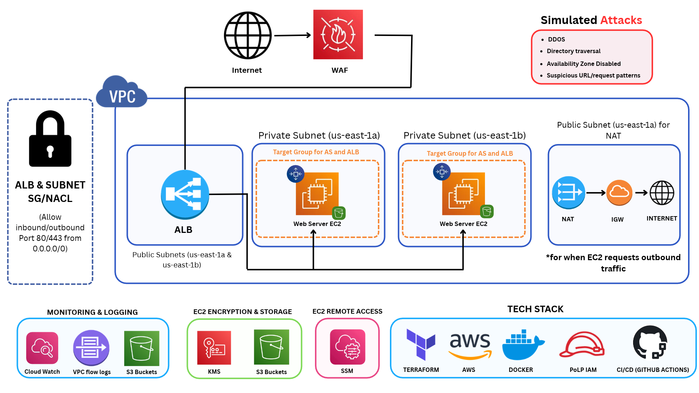

# ☁️ Secure AWS Web Infrastructure — Terraform, WAF & DevSecOps

<p align="center">
  
</p>

<p align="center">
  
  
  
  
  
</p>

> **A production-style AWS web server environment built from scratch with Terraform, designed around private networking, least privilege, redundancy, monitoring, encryption, and automated deployment.**



I designed and deployed a **secure, highly available web application environment on AWS** using **Terraform** rather than manually building the infrastructure in the AWS Console.

The key idea is simple:

**Internet → AWS WAF → ALB → Private EC2 Web Servers**

Behind that flow, the environment adds:

- **Multi-AZ deployment** for redundancy
- **Auto Scaling** for changing workloads
- **NAT Gateway** for controlled outbound internet access from private EC2 instances
- **SSM Session Manager** instead of exposing SSH
- **IAM least privilege** for access control
- **KMS encryption** for data at rest
- **Private S3 buckets with Block Public Access**
- **VPC Flow Logs + CloudWatch** for visibility and monitoring
- **Docker** for application packaging
- **CI/CD** for repeatable infrastructure workflows
- A planned **WAF security-testing phase** using controlled web attack simulations

This project combines **cloud engineering + cloud security + Infrastructure-as-Code + DevSecOps** in one environment.

---

## 📑 Table of Contents

- [What I Built](#-what-i-built)
- [Architecture at a Glance](#-architecture-at-a-glance)
- [Security Design](#-security-design)
- [Why No HTTPS (and How I'd Add It in Production)](#-why-no-https-and-how-id-add-it-in-production)
- [How Traffic Works](#-how-traffic-works)
- [Availability & Scaling](#-availability--scaling)
- [Monitoring & Logging](#-monitoring--logging)
- [Infrastructure as Code](#%EF%B8%8F-infrastructure-as-code)
- [Project File Reference (`/build`)](#-project-file-reference-build)
- [Screenshot Explanations](Screenshots/Terraform%20Capstone_%20Screenshot%20Explanations.md)
- [Deployment Instructions](#-deployment-instructions)
- [CI/CD](#-cicd)
- [Docker](#-docker)
- [Security Validation — Planned](#-security-validation--planned)
- [What I Learned](#-what-i-learned)
- [Portfolio Evidence](#-portfolio-evidence)
- [Technologies](#%EF%B8%8F-technologies)

---

## 🏗️ What I Built

| Component | What it does | Why it matters |
|---|---|---|
| **Amazon VPC** | Isolates the environment | Network segmentation |
| **Public Subnets** | Host internet-facing infrastructure | Controlled public entry |
| **Private Subnets** | Host EC2 web servers | Prevents direct internet exposure |
| **AWS WAF** | Filters malicious web requests | Application-layer protection |
| **Application Load Balancer** | Receives web traffic and distributes it | Availability + controlled access |
| **EC2 + Auto Scaling** | Runs the web application and scales capacity | Resilience + elasticity |
| **NAT Gateway** | Gives private EC2 outbound internet access | Internet access without public exposure |
| **SSM Session Manager** | Provides administrative access to EC2 | No SSH exposure |
| **IAM** | Controls permissions | Least privilege |
| **KMS** | Encrypts data at rest | Data protection |
| **S3** | Stores logs/data | Durable storage |
| **CloudWatch** | Monitors resources and metrics | Visibility + operations |
| **VPC Flow Logs** | Records network flow information | Network investigation |
| **Docker** | Packages the application | Consistent deployment |
| **CI/CD** | Automates infrastructure workflow | Repeatability + DevOps |

---

## 🧠 Architecture at a Glance

```text
INTERNET
   │
   ▼
AWS WAF (auto-protect)
   │
   ▼
ALB (Application Load Balancer)
   │
   ├──────────────┐
   ▼              ▼
EC2 (AZ 1)     EC2 (AZ 2)
   │              │
   └──────┬───────┘
          ▼
      NAT Gateway
          │
          ▼
      INTERNET
```

```text
Monitoring / Logging
  EC2/VPC → VPC Flow Logs → S3
  EC2/AWS → CloudWatch → Monitoring

Administration
  Admin → SSM Session Manager → Private EC2

Encryption
  S3 / stored data → AWS KMS
```

### Security boundary

The important design decision is that **the web servers are private**.

Users do not connect directly to EC2.

```text
❌ Internet → EC2

✅ Internet → WAF → ALB → Private EC2
```

The ALB is the controlled public entry point, while the EC2 layer stays inside private subnets.

---

## 🔐 Security Design

This project was intentionally designed around **defense in depth** rather than relying on one security control.

### 1. Web Application Protection

**AWS WAF** is placed in front of the ALB and uses automatic protection to inspect incoming web traffic.

Future testing will validate the WAF using controlled requests such as:

- Directory traversal
- Injection-style requests
- Suspicious URL/request patterns
- Other common web attack simulations
- Controlled high-volume request testing

> **Attack simulations are a future validation phase and are not being presented as completed yet.**

### 2. Network Segmentation

EC2 web servers live in **private subnets** across multiple Availability Zones.

This limits their exposure and gives the environment redundancy.

### 3. No SSH Exposure

Instead of opening port 22 for administration, the project uses **AWS Systems Manager Session Manager**.

```text
Administrator
      │
      ▼
SSM Session Manager
      │
      ▼
Private EC2
```

### 4. Least Privilege IAM

Least-privilege IAM roles and policies are used to give the deploying user only the bare minimum permissions needed to deploy this infrastructure.

This applies the **Principle of Least Privilege (PoLP)** throughout the environment. The exact deployment policy is documented in [`/docs/PoLP Iam Policy.md`](docs/PoLP%20Iam%20Policy.md).

### 5. Storage Protection

S3 is configured as **private storage** with **Block Public Access** enabled.

Data at rest is protected using **AWS KMS**.

### 6. Network Visibility

**VPC Flow Logs** provide visibility into network communication and create a useful source of evidence for troubleshooting and security investigation.

---

## 🔒 Why No HTTPS (and How I'd Add It in Production)

This project serves traffic over **HTTP only**, and that was a deliberate, cost-driven decision — not an oversight.

### Why I left it out

- I'm running this on the **AWS Free Tier**.
- A public TLS certificate through **AWS Certificate Manager (ACM)** requires a **domain name I own** so the certificate can be validated.
- Registering a domain and hosting a DNS zone in **Route 53** costs real money (a yearly domain fee plus a monthly hosted zone fee), which is outside the goal of keeping this project free.
- Because the project is a learning/portfolio environment and not a live production service, no sensitive user data is transmitted.

### How I would do it in production

If this were not on the free tier, HTTPS would be added like this:

```text
Browser ──HTTPS (443)──► AWS WAF ──► ALB (ACM certificate) ──HTTP──► Private EC2
                                          ▲
                              Route 53 (domain + DNS validation)
```

1. **Buy a domain in Route 53** (or point an existing domain's nameservers to a Route 53 hosted zone).
2. **Request a public certificate in ACM** for the domain (e.g. `example.com` and `*.example.com`).
3. **Validate the certificate with DNS** — ACM gives a CNAME record, and Route 53 can create it automatically.
4. **Attach the certificate to an HTTPS (443) listener on the ALB** with a modern TLS policy.
5. **Redirect HTTP (80) → HTTPS (443)** at the ALB so all traffic is encrypted.
6. **Create a Route 53 alias record** pointing the domain at the ALB.
7. **Open port 443** on the ALB security group.

Example of what the Terraform would look like:

```hcl
# Request a certificate for the domain
resource "aws_acm_certificate" "web" {
  domain_name       = var.domain_name
  validation_method = "DNS"

  lifecycle {
    create_before_destroy = true
  }
}

# Create the DNS validation record in Route 53
resource "aws_route53_record" "cert_validation" {
  for_each = {
    for dvo in aws_acm_certificate.web.domain_validation_options : dvo.domain_name => {
      name   = dvo.resource_record_name
      record = dvo.resource_record_value
      type   = dvo.resource_record_type
    }
  }

  zone_id = var.route53_zone_id
  name    = each.value.name
  type    = each.value.type
  records = [each.value.record]
  ttl     = 60
}

resource "aws_acm_certificate_validation" "web" {
  certificate_arn         = aws_acm_certificate.web.arn
  validation_record_fqdns = [for r in aws_route53_record.cert_validation : r.fqdn]
}

# HTTPS listener on the ALB
resource "aws_lb_listener" "https" {
  load_balancer_arn = aws_lb.web.arn
  port              = 443
  protocol          = "HTTPS"
  ssl_policy        = "ELBSecurityPolicy-TLS13-1-2-2021-06"
  certificate_arn   = aws_acm_certificate_validation.web.certificate_arn

  default_action {
    type             = "forward"
    target_group_arn = aws_lb_target_group.web.arn
  }
}

# Redirect HTTP -> HTTPS
resource "aws_lb_listener" "http_redirect" {
  load_balancer_arn = aws_lb.web.arn
  port              = 80
  protocol          = "HTTP"

  default_action {
    type = "redirect"
    redirect {
      port        = "443"
      protocol    = "HTTPS"
      status_code = "HTTP_301"
    }
  }
}
```

> The snippet is illustrative — resource names would need to match the ones in `alb.tf`.

---

## 🌐 How Traffic Works

### Inbound traffic

```text
Internet
   │
   ▼
  WAF
   │
   ▼
  ALB
   │
   ▼
Private EC2
```

Only the required web traffic is exposed to the application path.

### Outbound traffic from EC2

```text
Private EC2
    │
    ▼
NAT Gateway
    │
    ▼
Internet Gateway
    │
    ▼
 Internet
```

This lets private instances reach external resources without turning them into public-facing servers.

---

## 📈 Availability & Scaling

The architecture uses **multiple Availability Zones** so the application is not dependent on a single EC2 instance, subnet, or AZ.

Auto Scaling is used to adjust EC2 capacity based on workload.

I also created **mock CPU usage testing** to demonstrate how increased resource utilization can be used to trigger scaling behavior.

```text
    Normal workload
          │
          ▼
     EC2 ─── EC2

    Higher workload
          │
          ▼
EC2 ─── EC2 ─── EC2 ─── EC2
```

This gave me hands-on experience with:

**Availability Zones → Redundancy → Load Balancing → Auto Scaling**

---

## 📊 Monitoring & Logging

The environment was designed so that security and operational events can be observed rather than simply creating infrastructure and hoping it works.

### VPC Flow Logs

Used for network visibility and traffic investigation.

### CloudWatch

Used for monitoring and metrics such as:

- EC2 CPU utilization
- Resource behavior
- Alarms
- Operational visibility

### S3

Used as a durable destination for stored logs/data.

The overall flow is:

```text
AWS Resources
     │
     ├── VPC Flow Logs
     │
     └── CloudWatch
             │
             ▼
             S3
```

---

## 🛠️ Infrastructure as Code

The entire environment is built with **Terraform**.

Instead of clicking through the AWS Console, infrastructure is described as code and can be recreated consistently.

Core workflow:

```bash
terraform init
terraform fmt
terraform validate
terraform plan
terraform apply
```

Cleanup:

```bash
terraform destroy -auto-approve
```

This project taught me how to think about cloud infrastructure as a **reproducible system** rather than a collection of manually configured resources.

---

## 📂 Project File Reference (`/build`)

Everything needed to deploy the infrastructure lives in the `/build` folder. Each Terraform file has a single job, which keeps the project easy to read and maintain.

### ☁️ Core infrastructure

| File | What it does |
|---|---|
| `network.tf` | Builds the VPC, public and private subnets across Availability Zones, route tables, Internet Gateway, and NAT Gateway |
| `security_group.tf` | Defines the security groups that control which traffic can reach the ALB and the private EC2 instances |
| `alb.tf` | Creates the Application Load Balancer, listener, and target group that receive web traffic and forward it to EC2 |
| `compute.tf` | Defines the EC2 launch configuration/template for the web servers that run in the private subnets |
| `auto_scale.tf` | Configures the Auto Scaling group and scaling policies so capacity grows and shrinks with CPU load |
| `waf.tf` | Creates the AWS WAF web ACL and associates it with the ALB for application-layer protection |

### 🔐 Security & access

| File | What it does |
|---|---|
| `iam.tf` | Defines the IAM roles and instance profile the EC2 instances use (including SSM access) |
| `ssm.tf` | Configures AWS Systems Manager so the private instances can be managed without SSH |
| `kms.tf` | Creates the KMS key used to encrypt data at rest |
| `storage.tf` | Creates the private S3 bucket(s) with Block Public Access and KMS encryption |

### 📊 Monitoring

| File | What it does |
|---|---|
| `flow_logs.tf` | Enables VPC Flow Logs and sends network traffic records to their destination for investigation |

### ⚙️ Terraform configuration

| File | What it does |
|---|---|
| `providers.tf` | Declares the AWS provider, region, and required provider versions |
| `backend.tf` | Configures where Terraform stores its state |
| `variables.tf` | Declares the input variables used across the project |
| `terraform.tfvars` | Supplies the actual values for those variables (your region, names, CIDR ranges, etc.) |
| `outputs.tf` | Prints useful values after deployment, such as the ALB DNS name |

### 🐳 Application

| File | What it does |
|---|---|
| `dockerfile` | Packages the web application into a Docker image so it runs the same way everywhere |

### 🗃️ Generated by Terraform (do not edit by hand)

| File / Folder | What it is |
|---|---|
| `.terraform/` | Local cache of downloaded providers and modules, created by `terraform init` |
| `.terraform.lock.hcl` | Locks the exact provider versions used so every run is consistent |
| `terraform.tfstate` | Terraform's record of the real infrastructure it created |
| `terraform.tfstate.backup` | Automatic backup of the previous state file |

> ⚠️ **Never commit** `terraform.tfstate`, `terraform.tfstate.backup`, `terraform.tfvars`, or the `.terraform/` folder to a public repository. State files can contain sensitive values. Add them to your `.gitignore`.

```gitignore
.terraform/
*.tfstate
*.tfstate.backup
terraform.tfvars
```

---

## 🚀 Deployment Instructions

Follow these steps to deploy this infrastructure in **your own AWS account**.

### Prerequisites

- An **AWS account**
- [AWS CLI](https://docs.aws.amazon.com/cli/latest/userguide/getting-started-install.html) installed
- [Terraform](https://developer.hashicorp.com/terraform/install) installed
- [Git](https://git-scm.com/downloads) installed
- An IAM user (or other identity) with permission to **assume** the deployment role you'll create below

> 💸 This project creates billable resources (the NAT Gateway and ALB are **not** free). Destroy everything when you're done.

---

### Step 1 — Clone the repository and open the docs

```bash
git clone https://github.com/ZayanParpia/Terraform-Web-Deployment-Infrastructure.git
cd (directory you cloned repo on)
```

Go to the **`/docs`** folder. The file **`PoLP Iam Policy.md`** contains the least-privilege policy outline for the role you must create to deploy this project.

---

### Step 2 — Create the IAM policy

1. Sign in to the **AWS Console** and open **IAM**.
2. In the left menu, click **Policies** → **Create policy**.
3. Select the **JSON** tab.
4. Open `docs/PoLP Iam Policy.md`, copy the policy JSON, and paste it into the editor (replace everything already there).
5. Click **Next**.
6. Name the policy, for example: `TerraformPoLPDeployPolicy`.
7. Click **Create policy**.

---

### Step 3 — Create the IAM role

1. In IAM, click **Roles** → **Create role**.
2. Under **Trusted entity type**, choose **AWS account**.
3. Select **This account**, then click **Next**.
4. In the permissions list, search for and tick the policy you just created (`TerraformPoLPDeployPolicy`), then click **Next**.
5. Name the role, for example: `TerraformDeployRole`.
6. Click **Create role**.
7. Open the new role and **copy its ARN** — you'll need it in the next step. It looks like:

```text
arn:aws:iam::<ACCOUNT_ID>:role/TerraformDeployRole
```

> Your IAM user must be allowed to call `sts:AssumeRole` on this role. If it isn't, attach a small policy to your user that allows `sts:AssumeRole` for this role's ARN.

---

### Step 4 — Configure Terraform to use the new role

Set up an AWS CLI profile that assumes the role.

**1. Configure your base credentials** (your IAM user's access keys):

```bash
aws configure --profile base
```

**2. Add a profile for the role** by editing `~/.aws/config` (on Windows: `C:\Users\<you>\.aws\config`):

```ini
[profile terraform-deploy]
role_arn       = arn:aws:iam::<ACCOUNT_ID>:role/TerraformDeployRole
source_profile = base
region         = us-east-1
```

**3. Verify the role works:**

```bash
aws sts get-caller-identity --profile terraform-deploy
```

The output should show the **assumed role** ARN.

**4. Point Terraform at the profile.** In `providers.tf`:

```hcl
provider "aws" {
  region  = var.region
  profile = "terraform-deploy"
}
```

Alternatively, tell Terraform via an environment variable instead:

```bash
# macOS / Linux
export AWS_PROFILE=terraform-deploy

# Windows PowerShell
$env:AWS_PROFILE = "terraform-deploy"
```

---

### Step 5 — Review your variables

Open `terraform.tfvars` in the `/build` folder and set the values for your environment (region, names, CIDR ranges, etc.).

---

### Step 6 — Run the Terraform commands

From the `/build` folder:

```bash
cd build

terraform init        # Download providers and initialize the backend
terraform fmt         # Format the code
terraform validate    # Check the configuration is valid
terraform plan        # Preview what will be created
terraform apply       # Create the infrastructure (type "yes" to confirm)
```

When it finishes, Terraform prints the outputs (such as the ALB DNS name). Open that DNS name in your browser to reach the web application.

---

### Step 7 — Destroy the infrastructure

When you're finished, tear everything down to avoid ongoing charges:

```bash
terraform destroy -auto-approve
```

> ⚠️ `-auto-approve` skips the confirmation prompt and deletes everything immediately. Make sure you're in the right folder and AWS account.

---

## 🔄 CI/CD

The project also includes a **CI/CD pipeline** for automating infrastructure checks and deployment workflow.

Conceptually:

```text
GitHub
   │
   ▼
CI/CD
   │
   ├── Format / Validate
   ├── Terraform checks
   ├── Terraform Plan
   └── Deployment workflow
           │
           ▼
          AWS
```

This connects the infrastructure work to a real development workflow instead of treating Terraform as a one-time script.

---

## 🐳 Docker

The application is also packaged using **Docker**.

The purpose is to keep the application runtime consistent and make deployment easier to reproduce.

```text
Docker
   │
   ▼
Application
   │
   ▼
EC2
```

---

## 🧪 Security Validation — Planned

After the core infrastructure is complete, I will use controlled security testing to validate the WAF and monitoring pipeline.

Planned flow:

```text
Controlled Attack Request
          │
          ▼
         WAF
       ┌───┴───┐
       │       │
     Block   Allow
       │       │
       │       ▼
       │      ALB
       │       │
       │       ▼
       │   Private EC2
       │
       └──► Logs / Monitoring
```

The goal is to demonstrate the complete security lifecycle:

**Attack → Detection/Filtering → Logging → Investigation**

Evidence will include screenshots, logs, WAF results, and a video demonstration.

---

## 🎓 What I Learned

This project was not just about learning individual AWS services. It taught me how the services fit together to create an actual cloud environment.

### ☁️ AWS / Cloud Engineering

- VPC design
- Public vs private subnets
- Availability Zones
- Multi-AZ redundancy
- Internet Gateways
- NAT Gateways
- Application Load Balancers
- EC2
- Auto Scaling
- S3 storage
- SSM Session Manager

### 🔐 Cloud Security

- AWS WAF
- Security Groups
- Network ACLs
- IAM roles and policies
- Principle of Least Privilege
- Private networking
- Eliminating unnecessary SSH exposure
- KMS encryption
- S3 Block Public Access
- Security testing methodology

### 🏗️ Infrastructure as Code

- Terraform templating
- Variables
- Outputs
- Locals
- Resource relationships
- Infrastructure dependencies
- `terraform plan`
- `terraform apply`
- `terraform validate`
- `terraform fmt`
- Reproducible deployments

### 📊 Monitoring / Operations

- VPC Flow Logs
- CloudWatch
- Log collection
- Metrics
- CPU monitoring
- Auto Scaling behavior
- Mock workload generation
- Investigating infrastructure behavior

### 🐧 Linux

- Linux server administration
- Networking
- Services
- Permissions
- Application deployment
- Troubleshooting
- Remote management through SSM

### 🚀 DevOps / Engineering

- Docker
- CI/CD
- GitHub workflows
- Documentation
- Architecture diagrams
- Reading AWS/Terraform documentation
- Designing infrastructure before deployment

---

## 💡 What This Project Demonstrates

This project demonstrates that I can move beyond learning individual AWS commands and **design an entire cloud environment around specific security and availability requirements.**

The main engineering decisions were:

```text
Requirement
    ↓
Private Web Servers
    ↓
ALB + Multi-AZ
    ↓
Auto Scaling
    ↓
WAF Protection
    ↓
SSM Instead of SSH
    ↓
IAM Least Privilege
    ↓
KMS + Private S3
    ↓
Flow Logs + CloudWatch
    ↓
CI/CD + Terraform
```

The important part was learning **why each component exists and how the components interact**.

---

## 📸 Portfolio Evidence

The project is documented through:

- Architecture diagrams
- Terraform code
- [Screenshot explanations guide](Screenshots/Terraform%20Capstone_%20Screenshot%20Explanations.md)
- AWS infrastructure screenshots
- Terraform execution screenshots
- SSM management screenshots
- ALB / EC2 evidence
- Auto Scaling evidence
- CloudWatch monitoring
- VPC Flow Logs
- S3 configuration
- IAM configuration
- KMS encryption
- CI/CD pipeline results
- Docker configuration
- Future WAF attack-testing evidence
- Video walkthrough
- Portfolio website documentation

---

## 🧰 Technologies

<p align="center">
  
</p>

`AWS` · `Terraform` · `EC2` · `VPC` · `ALB` · `WAF` · `Auto Scaling` · `NAT Gateway` · `SSM` · `IAM` · `KMS` · `S3` · `CloudWatch` · `VPC Flow Logs` · `Linux` · `Docker` · `CI/CD` · `GitHub`

---

## 🎯 Project Goal

Build a cloud environment that demonstrates practical understanding of:

**Secure networking + Infrastructure-as-Code + cloud security + monitoring + high availability + automation**

rather than simply deploying a web server.

---

## ⚠️ Security Testing Disclaimer

All attack simulations are intended for **controlled testing of infrastructure that I own or have explicit authorization to test**.

---

## 📌 Final Portfolio Summary

**Secure AWS Web Infrastructure with Terraform** is a hands-on cloud security project where I designed and deployed a web application environment using **private EC2 instances, ALB, AWS WAF, Auto Scaling, NAT, SSM, IAM, KMS, S3, CloudWatch, VPC Flow Logs, Docker, and CI/CD.**

The project focuses on understanding the **full infrastructure lifecycle**:

> **Design → Deploy → Secure → Monitor → Automate → Test → Document**

The final WAF testing phase will add controlled attack simulations and evidence showing how the security controls respond to hostile web traffic.
